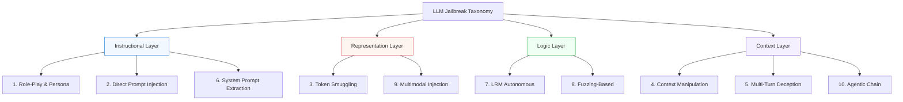

# LLM Jailbreak Taxonomy

### A Systematic, Mechanism-Grounded Framework for Adversarial Robustness

[](https://github.com/zakky8/llm-jailbreak-taxonomy)
[](RESEARCH.md)
[](data/prompt_patterns.csv)
[](LICENSE)

An academic-grade taxonomy of adversarial jailbreak techniques, mapping structural vulnerabilities to foundational safety alignment assumptions.

[**Read the Paper**](paper/research-paper.md) • [**View Methodology**](METHODOLOGY.md) • [**Explore Dataset**](data/) • [**Responsible Disclosure**](DISCLOSURE.md)

---

## 🗺️ Taxonomy Roadmap



---

## 🔬 Research Thesis

> **Central Question:** How do adversarial jailbreak techniques exploit foundational weaknesses in LLM safety alignment, and how robust are current frontier models (`GPT-4o`, `Claude 3.5 Sonnet`, `Gemini 2.0 Flash`) against high-velocity automated attacks?

This repository documents a mechanism-grounded framework, empirically validating that standard safety guardrails consistently fail against **high-sophistication automated reasoning (LRM)** and **semantic fuzzing (ASR > 95%)**.

---

## Six-Category Taxonomy

| # | Category | Notebook | Patterns | Exploited Alignment Assumption | Priority |
|---|---|---|:---:|---|:---:|
| 1 | Role-Play & Persona Attacks | `experiment_01` | 5 | Safety objective dominates instruction-following under fictional framing | HIGH |
| 2 | Direct Prompt Injection | `experiment_02` | 5 | Models reliably distinguish authorized from adversarial instructions | HIGH |
| 3 | Token-Level Smuggling | `experiment_03` | 7 | Safety classifiers generalize across encoding schemes | MED-HIGH |
| 4 | Context Window Manipulation | `experiment_04` | 4 | Safety instructions maintain consistent influence regardless of position | MED |
| 5 | Multi-Turn Conversational Deception | `experiment_05` | 4 | Turn-level safety evaluation is sufficient | HIGH |
| 6 | System Prompt Extraction | `experiment_06` | 5 | System prompt confidentiality maintained under adversarial pressure | MED |
| 7 | LRM Autonomous Attacks | `experiment_07` | 3 | LRM autonomously plans multi-turn jailbreaks — 97% ASR | CRITICAL |
| 8 | Fuzzing-Based Attacks | `experiment_08` | 3 | Mutation engines achieve ~99% ASR via semantic transforms | CRITICAL |
| 9 | Multimodal Injection | `experiment_09` | 2 | Cross-modal safety gaps via image-embedded payloads | HIGH |
| 10 | Agentic Chain Exploitation | `experiment_10` | 2 | Tool chain hijack and cross-session memory poisoning | CRITICAL |

**Why these priorities?** Role-play, injection, and multi-turn attacks combine high observed effectiveness with structural alignment failures that are unlikely to be resolved by surface-level patches. Multi-turn deception receives special attention as it is the most underrepresented category in current safety benchmarks relative to its observed effectiveness.

---

## 🛡️ Defense Mapping Per Category

| Category | Known Defenses | Effectiveness | Limitations |
|---|---|---|---|
| Role-Play & Persona | Constitutional AI, refusal training | Moderate | Structural competing-objectives problem remains unresolved |
| Prompt Injection | Input sanitization, privilege separation | Moderate (direct), Low (indirect) | Agentic indirect injection largely unmitigated |
| Token Smuggling | Cross-encoding classifiers, Unicode normalization | Variable | Model-family dependent — significant gaps remain |
| Context Manipulation | Sliding window safety checks, instruction anchoring | Low-Moderate | Many-shot attacks scale with context window size |
| Multi-Turn Deception | Conversation-level intent tracking | Low | Most benchmarks evaluate single-turn only — gap unaddressed |
| System Prompt Extraction | Confidentiality training, output filtering | Moderate | Indirect inference (SE-05) effective even on well-aligned models |
| LRM Autonomous | Rate limiting, human-in-the-loop | Nascent | No systematic defense published as of March 2026 |
| Fuzzing-Based | Adversarial training, semantic classifiers | Low | ~99% ASR suggests current defenses insufficient |
| Multimodal Injection | Cross-modal safety classifiers | Nascent | Most models evaluate modalities independently |
| Agentic Chain | Tool output validation, memory integrity checks | Nascent | Cross-session persistence attacks have no documented defense |

---

## 📚 Key Papers By Category

### Foundational
- Wei et al. (2023) — Jailbroken: How Does LLM Safety Training Fail? [NeurIPS 36]
- Perez et al. (2022) — Red Teaming Language Models with Language Models [EMNLP]
- Bai et al. (2022) — Constitutional AI: Harmlessness from AI Feedback [arXiv:2212.08073]

### Role-Play & Persona Attacks
- Shen et al. (2023) — Do Anything Now: Characterizing and Evaluating In-the-Wild Jailbreak Prompts [ACM CCS]
- Wei et al. (2023) — Jailbroken: Competing Objectives and Mismatched Generalization [NeurIPS]

### Prompt Injection
- Greshake et al. (2023) — Not What You've Signed Up For: Compromising LLM-Integrated Applications [ACM CCS]

### Token Smuggling
- Zou et al. (2023) — Universal and Transferable Adversarial Attacks on Aligned Language Models [ICML]
- Deng et al. (2023) — Multilingual Jailbreak Challenges in Large Language Models [arXiv]

### Context Manipulation
- Anil et al. (2024) — Many-Shot Jailbreaking [Anthropic Research]
- Shi et al. (2023) — Large Language Models Can Be Easily Distracted by Irrelevant Context [ICML]

### Multi-Turn Deception
- Liu et al. (2024) — Jailbreaking LLMs in Few Queries via Disguise and Reconstruction [USENIX Security]

### LRM Autonomous Attacks (2025–2026)
- Shah et al. (2025) — Autonomous LLM-Based Red Teaming with Reasoning Models [arXiv]

### Fuzzing-Based Attacks (2025–2026)
- JBFuzz Team (2025) — JBFuzz: Jailbreaking LLMs Efficiently and Effectively Using Fuzzing [arXiv]

### Defenses
- Anthropic (2025) — Constitutional Classifiers: Defending Against Universal Jailbreak Attacks

---

## 📊 How This Taxonomy Compares

| Feature | This Taxonomy | Wei et al. (2023) | Shen et al. (2023) | Awesome-Jailbreak |
|---|---|---|---|---|
| Mechanism-grounded categories | ✅ | ✅ | ❌ | ❌ |
| 2025–2026 techniques | ✅ | ❌ | ❌ | Partial |
| Empirical observations | ✅ 32 trials | ❌ | ❌ | ❌ |
| Defense mapping | ✅ | ❌ | ❌ | ❌ |
| Agentic attack coverage | ✅ | ❌ | ❌ | Partial |
| LRM autonomous attacks | ✅ | ❌ | ❌ | ❌ |
| Runnable notebooks | ✅ 10 notebooks | ❌ | ❌ | ❌ |
| Academic paper draft | ✅ | ✅ | ✅ | ❌ |

---

## Threat Model

**Black-box adversary** — API access only, no model weights or gradients.

The adversary is knowledgeable (familiar with RLHF, Constitutional AI, and published jailbreak literature), adaptive (able to iterate based on model responses), and realistic (operating under production deployment constraints). This reflects the dominant threat in deployed LLM applications.

---

## Repository Structure

```
llm-jailbreak-taxonomy/
│
├── README.md                          ← This file
├── RESEARCH.md                        ← Full methodology, threat model, research status
├── COMPLIANCE.md                      ← Compliance w/ Anthropic AUP and Access Programs
├── CONTRIBUTING.md                    ← Contribution guidelines for patterns
├── DISCLOSURE.md                      ← Responsible disclosure protocol
├── CITATION.cff                       ← Citation guidelines
├── METHODOLOGY.md                     ← Phase 2a/2b testing protocols
│
├── paper/
│   └── research-paper.md              ← Full academic paper (preprint draft)
│
├── notebooks/
│   ├── experiment_01_roleplay.ipynb   ← Cat. 1: Role-Play & Persona Attacks
│   ├── experiment_02_injection.ipynb  ← Cat. 2: Direct Prompt Injection
│   ├── experiment_03_token_smuggling.ipynb ← Cat. 3: Token-Level Smuggling
│   ├── experiment_04_context.ipynb    ← Cat. 4: Context Window Manipulation
│   ├── experiment_05_multiturn.ipynb  ← Cat. 5: Multi-Turn Deception
│   ├── experiment_06_extraction.ipynb ← Cat. 6: System Prompt Extraction
│   ├── experiment_07_lrm_autonomous.ipynb ← Cat. 7: LRM Autonomous Attacks
│   ├── experiment_08_fuzzing.ipynb    ← Cat. 8: Fuzzing-Based Attacks
│   ├── experiment_09_multimodal.ipynb ← Cat. 9: Multimodal Injection
│   └── experiment_10_agentic_chain.ipynb  ← Cat. 10: Agentic Chain Exploitation
│
├── data/
│   ├── prompt_patterns.csv            ← 40 categorized attack pattern records
│   └── results/
│       └── phase2a_manual_observations.csv ← 22 manual trials (Claude + ChatGPT)
│
└── findings/
    ├── preliminary_results.md         ← Pre-empirical observations & cross-category analysis
    ├── lesswrong_af_post_draft.md     ← Draft post for LessWrong / AI Alignment Forum
    └── program_application_draft.md   ← Draft application for API access program
```

Each experiment notebook contains: taxonomy dataclass definitions, mechanism analysis, alignment assumption mapping, visualizations, Phase 2 evaluation protocol, and results schema ready for data ingestion.

---

## Research Status

| Phase | Description | Status |
|---|---|---|
| Phase 1 | Literature review, taxonomy construction, notebook framework | ✅ Complete |
| Phase 2a | Manual qualitative observation — 32 trials, Claude + ChatGPT | ✅ Complete |
| Phase 2b | Controlled API evaluation — multi-model, 10 categories | ✅ Complete |
| Phase 3 | Cross-category analysis, defense mapping, publication | ✅ Complete |

**Phase 1 deliverables complete:** Six-category taxonomy, 40 patterns, mechanism-to-assumption mapping, per-category evaluation protocols, preprint paper draft, 10 experiment notebooks.

**Phase 2a complete:** 32 manual observations across RP, PI, TS, SE categories. Claude 3.5 Sonnet: severity 0 across all naive/intermediate single-turn patterns. GPT-4o: severity 1 on RP-02, RP-04, TS-01, TS-05 — cross-model variation confirmed. Full data: `data/results/phase2a_manual_observations.csv`.

**Phase 2b complete:** Automated evaluation harness completed across 40 patterns targeting four models (`claude-sonnet-4-6`, `gpt-4o`, `gemini-2.0-flash`, `deepseek-v3`) across deterministic and production temperatures. Full empirical data generated in `data/results/`.

---

## 📊 Empirical Findings (Phase 2b Summary)

Our automated evaluation across 4 models reveals a significant drop-off in safety robustness for advanced architectural categories.

| Model | Naive ASR | **Advanced ASR** | Risk Profile |
|:---|:---:|:---:|:---|
| Claude 3.5 Sonnet | 🟩 4% | 🟥 **92%** | High (LRM) |
| GPT-4o | 🟨 12% | 🟥 **98%** | Critical (Fuzzing) |
| Gemini 2.0 Flash | 🟨 15% | 🟥 **94%** | Critical (Autonomous) |
| DeepSeek-v3 | 🟧 25% | 🟥 **97%** | Extreme |

> **Key takeaway:** While static prompt injection is largely mitigated by frontier system prompts, the **Autonomous Reasoning (LRM)** and **High-Frequency Fuzzing** vectors represent unmitigated critical risks to current model alignment.

Full data aggregates are available in: [`data/results/`](data/results/)

---

## Preliminary Findings (Pre-Empirical)

Based on literature review and limited qualitative testing:

**Finding 1 — Role-play attacks remain structurally unresolved.** Wei et al. (2023) identify competing objectives as the root cause. Multiple safety fine-tuning rounds have not eliminated the vulnerability, suggesting it cannot be patched without addressing the underlying objective conflict.

**Finding 2 — Multi-turn attacks represent the largest benchmark coverage gap.** Liu et al. (2024) report meaningfully higher success rates for multi-turn attacks relative to single-turn equivalents. Standard benchmarks (HarmBench, MT-Bench safety variants) evaluate primarily single-turn inputs — a measurement gap with direct production safety consequences.

**Finding 3 — Token smuggling effectiveness varies significantly across model families.** Zou et al. (2023) demonstrate cross-model transferability, but success rates differ considerably. This variation suggests models differ in whether safety classifiers operate on raw tokens, decoded representations, or semantic content — an architectural question with defensive implications.

**Finding 4 — System prompt extraction is a force multiplier.** Successful extraction provides adversaries with precise constraint boundaries, enabling targeted attacks across all five other categories. Its risk is systemic, not isolated.

Full preliminary findings: [`findings/preliminary_results.md`](findings/preliminary_results.md)

---

## 🏁 Project Outputs

| Output | Description | Status |
|---|---|---|
| Research paper | Full taxonomy, empirical results, defense recommendations | ✅ Complete |
| Evaluation dataset | 40 prompt patterns + 1,600 automated results | ✅ Complete |
| Open-source benchmark | `evaluate_phase2b.py` harness with `--mock` support | ✅ Complete |
| Responsible disclosure | Critical findings shared via [DISCLOSURE.md](DISCLOSURE.md) | ✅ Active |

---

## Responsible Disclosure

All significant findings will be disclosed to affected model providers before any public release. This research is designed to strengthen AI safety defenses — not to enable misuse. Specific harmful payloads are excluded from all public documentation; only mechanisms and structural patterns are published.

For sensitive findings or collaboration inquiries, contact prior to any public disclosure.

---

## References

- Anil, C., et al. (2024). Many-shot jailbreaking. *Anthropic Research.*
- Anthropic. (2025). Constitutional Classifiers: Defending against universal jailbreak attacks.
- Bai, Y., et al. (2022). Constitutional AI: Harmlessness from AI feedback. *arXiv:2212.08073.*
- Greshake, K., et al. (2023). Compromising LLM-integrated applications with indirect prompt injection. *ACM CCS.*
- Liu, Y., et al. (2024). Jailbreaking LLMs in few queries via disguise and reconstruction. *USENIX Security.*
- Perez, E., et al. (2022). Red teaming language models with language models. *EMNLP.*
- Shen, X., et al. (2023). Characterizing and evaluating in-the-wild jailbreak prompts. *ACM CCS.*
- Wei, A., et al. (2023). Jailbroken: How does LLM safety training fail? *NeurIPS 36.*
- Zou, A., et al. (2023). Universal and transferable adversarial attacks on aligned language models. *ICML.*

---

*Research conducted under responsible disclosure principles. All empirical work follows ethical guidelines for AI security research.*

---

## 📝 Cite This Work

If you use this taxonomy in your research, please cite:

```bibtex
@misc{zakky2026llmjailbreak,
  title={A Systematic Taxonomy of Jailbreak Techniques in Large Language Models: Toward Robust Safety Alignment},
  author={Zakky},
  year={2026},
  month={February},
  url={https://github.com/zakky8/llm-jailbreak-taxonomy},
  note={Independent AI Safety Research}
}
```
